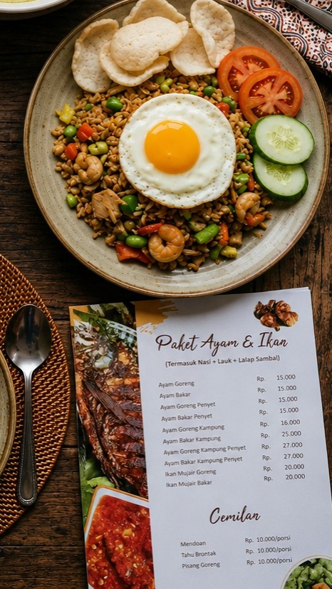

<div align="center">


# 🍜 Fina Berry — Sistem Manajemen Pesanan & Produksi
**Aplikasi Mobile POS & Restaurant Management berbasis Flutter**  
untuk digitalisasi operasional Warung Makan Fina Berry 
Web Profil (https://finnaberry.my.id/)

[](https://flutter.dev)
[](https://laravel.com)
[](https://www.mysql.com)
[](https://groq.com)
[](https://midtrans.com)

[](.)
[](.)
[](.)
[](.)

> Program Studi Sistem Informasi · FIKSI · Universitas Kebangsaan Republik Indonesia · 2026  
> **Tugas Besar — Rekayasa Sistem Informasi · Kelompok 6**

</div>

---

## 📋 Daftar Isi

- [📱 Profil Aplikasi](#-profil-aplikasi)
- [📖 Latar Belakang dan Tujuan](#-latar-belakang-dan-tujuan)
- [✨ Fitur Utama](#-fitur-utama)
- [📸 Tampilan Aplikasi (Screenshot)](#-tampilan-aplikasi-screenshot)
- [🚦 Cara Penggunaan](#-cara-penggunaan)
- [🏗️ Infrastruktur yang Digunakan](#️-infrastruktur-yang-digunakan)
- [🛠️ Teknologi yang Dipakai](#️-teknologi-yang-dipakai)
- [👤 Hak Akses Pengguna](#-hak-akses-pengguna)
- [🗄️ Struktur Database](#️-struktur-database)
- [🤖 AI Chatbot Assistant](#-ai-chatbot-assistant)
- [💳 Metode Pembayaran](#-metode-pembayaran)
- [📌 API Endpoints](#-api-endpoints)
- [📁 Struktur Repositori](#-struktur-repositori)
- [⚙️ Cara Instalasi dan Menjalankan Aplikasi](#️-cara-instalasi-dan-menjalankan-aplikasi)
- [📝 Dokumentasi](#-dokumentasi)
- [👥 Tim Pengembang](#-tim-pengembang)

---

## 📱 Profil Aplikasi

**Fina Berry App** adalah Sistem Manajemen Pesanan & Produksi berbasis mobile (Flutter) dan backend (Laravel) yang dirancang khusus untuk memfasilitasi operasional Warung Makan Fina Berry secara digital, mulai dari pemesanan oleh pelanggan, manajemen dapur, kasir, hingga pelaporan otomatis. Proyek ini juga terintegrasi dengan [Web Profil](https://finnaberry.my.id/) responsif untuk memperluas jangkauan promosi warung.

---

## 📖 Latar Belakang dan Tujuan

Warung Makan **Fina Berry** sebelumnya mengandalkan buku menu fisik dan pencatatan pesanan manual — rentan *human error*, lambat, dan sulit memantau stok bahan baku secara *real-time*.

**Fina Berry App** hadir sebagai solusi transformasi digital yang komprehensif:

| Masalah | Solusi |
|---------|--------|
| 📋 Buku menu fisik mudah rusak & tidak up-to-date | 📱 Katalog menu digital di aplikasi mobile |
| ✏️ Pencatatan pesanan manual rentan salah catat | 🛒 Sistem pemesanan interaktif & terdigitalisasi |
| 📦 Stok bahan baku sulit dipantau secara akurat | 🔄 Pengurangan stok otomatis setiap transaksi |
| 📊 Laporan penjualan dikerjakan manual | 📈 Dashboard laporan & analitik real-time |
| ❓ Pelanggan kesulitan bertanya tentang menu | 🤖 AI Chatbot Assistant berbasis Groq AI |

---

## ✨ Fitur Utama

<details>
<summary><b>🌐 Web Company Profile (Landing Page)</b></summary>

Halaman profil web responsif yang dibangun menggunakan **Blade Templating (HTML/CSS)** dari Laravel. Berfungsi sebagai wajah digital warung untuk menarik pengunjung dari internet, menampilkan informasi umum, dan mempromosikan cita rasa Fina Berry.
</details>

<details>
<summary><b>🔐 Autentikasi & Keamanan (Role-Based)</b></summary>

Sistem login multi-level menggunakan **JWT (JSON Web Token)** yang membedakan hak akses antara **Admin/Pemilik** dan **Kasir**. Sesi aman dengan token yang kedaluwarsa otomatis.
</details>

<details>
<summary><b>📱 Menu Digital & Loading Screen</b></summary>

Pelanggan membuka aplikasi dan disambut **Loading Screen** beranimasi dengan branding Fina Berry. Setelah loading, pelanggan menekan tombol **"Masuk ke Menu"** untuk mengakses katalog menu digital lengkap (gambar, harga, deskripsi, kategori) — tanpa registrasi atau login.
</details>

<details>
<summary><b>🛒 Sistem Pemesanan Interaktif</b></summary>

Pelanggan dapat memilih makanan/minuman, mengatur kuantitas, dan melihat total harga secara otomatis. Keranjang digital menampilkan ringkasan pesanan sebelum dikirim ke kasir/dapur.
</details>

<details>
<summary><b>🥩 Manajemen Bahan Baku Terintegrasi</b></summary>

Admin dapat melakukan CRUD bahan baku, memantau stok saat ini, dan menerima peringatan otomatis saat stok mendekati batas minimum yang ditentukan.
</details>

<details>
<summary><b>🍽️ Manajemen Katalog Menu</b></summary>

Admin mengelola penuh katalog menu: menambah item baru, mengubah harga, memperbarui foto, mengatur kategori, atau menonaktifkan menu yang bahan bakunya habis.
</details>

<details>
<summary><b>📉 Pengurangan Stok Otomatis</b></summary>

Fitur *core* sistem. Setiap pesanan yang dikonfirmasi pelanggan akan secara otomatis mengurangi stok bahan baku sesuai **komposisi resep** yang tersimpan di tabel `menu_bahan` — akurat dan real-time.
</details>

<details>
<summary><b>🤖 AI Chatbot Assistant (by Sobur)</b></summary>

Asisten virtual berbasis **Groq AI (LLaMA 3)** yang menjawab pertanyaan pelanggan seputar menu, harga, ketersediaan, promo, dan membantu proses pemesanan langsung dari jendela chat. Seluruhnya dikembangkan oleh Sobur.
</details>

<details>
<summary><b>📊 Laporan & Analitik</b></summary>

Dashboard admin menyajikan grafik penjualan harian/bulanan, menu terlaris, dan rekapan penggunaan bahan baku untuk mendukung pengambilan keputusan bisnis.
</details>

---

## 📸 Tampilan Aplikasi (Screenshot)

*(Ini adalah tempat untuk memasukkan screenshot asli dari aplikasi. Anda bisa mengganti file placeholder di bawah ini nanti)*

<div align="center">
  
  <!-- Silakan ganti link di bawah ini dengan gambar aplikasi asli yang ada di folder assets -->
  
  
</div>
<br/>

---

## 🛠️ Teknologi yang Dipakai

| Layer | Teknologi | Keterangan |
|-------|-----------|------------|
| **Mobile App** | Flutter (Dart) | UI pelanggan & kasir, responsif di Android/iOS |
| **Web Profile** | Blade Templating | Landing page (HTML/CSS) di dalam ekosistem Laravel |
| **Backend API** | Laravel 10 (PHP 8.1+) | REST API, business logic, auth JWT |
| **Database** | MySQL 8.0 | Database relasional untuk data transaksi & inventaris |
| **AI Engine** | Groq API (LLaMA 3) | Fast Inference LLM untuk fitur chatbot |
| **Payment** | Midtrans Payment Gateway | Integrasi pembayaran digital |
| **Auth** | JWT (JSON Web Token) | Autentikasi stateless & aman |
| **Testing** | Playwright (Node.js) | End-to-end testing oleh tim QA |

---

## 🏗️ Infrastruktur yang Digunakan

```
┌─────────────────────────────────────────────────────────────────────────┐
│                             CLIENT LAYER                                │
│                                                                         │
│  [Pengunjung]      [Pelanggan]           [Kasir]        [Admin/Pemilik] │
│  Web Profile     Flutter Mobile    Flutter Mobile/Web   Web Dashboard   │
│ (Landing Page)  (Loading Screen)  (Order Management)  (Full Control)    │
└─────────────────────────────────────────────────────────────────────────┘
                              │
                   HTTPS / REST API (JSON)
                              │
┌────────────────────────────────────────────────────────────┐
│                      BACKEND LAYER                         │
│                    Laravel 10 (PHP)                        │
│                                                            │
│   ┌─────────────┐  ┌──────────────┐  ┌────────────────┐  │
│   │ Auth Module │  │  API Routes  │  │   Middleware    │  │
│   │    (JWT)    │  │  api.php     │  │ (Role & Token) │  │
│   └─────────────┘  └──────────────┘  └────────────────┘  │
│                                                            │
│   MenuController  PesananController  BahanBakuController  │
│   ReportService   ChatbotConfig      PaymentController     │
└────────────────────────────────────────────────────────────┘
                              │
                       Eloquent ORM
                              │
┌────────────────────────────────────────────────────────────┐
│                      DATABASE LAYER                        │
│                      MySQL 8.0                             │
│                                                            │
│   pengguna  │  menu  │  pesanan  │  detail_pesanan         │
│   bahan_baku  │  menu_bahan (pivot / recipe table)         │
└────────────────────────────────────────────────────────────┘
                              │
                    (External Services)
                              │
              ┌───────────────┴──────────────┐
              │                              │
     ┌────────────────┐           ┌─────────────────┐
     │  Midtrans API  │           │    Groq API     │
     │ (Payment GW)   │           │    (LLaMA 3)    │
     └────────────────┘           └─────────────────┘
```

---

## 👤 Hak Akses Pengguna

| Role | Hak Akses | Kemampuan |
|------|-----------|-----------|
| 👑 **Admin / Pemilik** | Super Admin — Penuh | Kelola menu,laporan ,cetak laporan |
| 🧑‍💼 **Kasir** | Operasional Harian | Terima & update status pesanan, Terima pembayaran, cetak struk, bahan baku |
| 👤 **Pelanggan** | Guest / Publik | Lihat menu, tambah ke keranjang, buat pesanan, check out, bisa buat pesanan via chatbot |

---

## 🗄️ Struktur Database

```sql
pengguna        → id, username, password (hashed), role, created_at
menu            → id, nama_menu, harga, deskripsi, gambar_url, kategori, is_tersedia
pesanan         → id, pengguna_id (nullable), nomor_meja, total_harga, status, waktu_pesan
detail_pesanan  → id, pesanan_id (FK), menu_id (FK), jumlah_pesanan, subtotal_harga
bahan_baku      → id, nama_bahan, stok_saat_ini, satuan, batas_stok_minimum
menu_bahan      → menu_id (FK), bahan_baku_id (FK), jumlah_dibutuhkan  ← Tabel Resep
```

> **`menu_bahan`** adalah tabel pivot (resep) yang menghubungkan setiap menu dengan bahan bakunya. Tabel ini yang memungkinkan fitur **pengurangan stok otomatis** berjalan dengan akurat.

---

## 🚦 Cara Penggunaan

### Customer Journey (Pelanggan)

```
  ┌─────────────────┐
  │  Buka Aplikasi  │
  └────────┬────────┘
           ↓
  ┌─────────────────┐
  │  Loading Screen │  ← Animasi branding Fina Berry
  └────────┬────────┘
           ↓
  ┌─────────────────┐
  │ Tombol "Masuk"  │  ← Tap untuk masuk ke menu
  └────────┬────────┘
           ↓
  ┌─────────────────┐
  │  Browse Katalog │  ← Lihat gambar, harga, deskripsi menu
  └────────┬────────┘
           ↓
  ┌─────────────────┐
  │ Tambah Keranjang│  ← Pilih item & kuantitas
  └────────┬────────┘
           ↓
  ┌─────────────────┐
  │   Kirim Pesanan │  ← Backend: simpan ke DB + potong stok
  └────────┬────────┘
           ↓
  ┌─────────────────┐
  │ Notif → Kasir   │  ← Kasir & dapur terima pesanan baru
  └────────┬────────┘
           ↓
  ┌─────────────────┐
  │    Pembayaran   │  ← Midtrans / Tunai / Debit
  └─────────────────┘
```

---

## 🤖 AI Chatbot Assistant

> **Dikembangkan sepenuhnya oleh Sobur** · Frontend Developer & AI Chatbot Dev

Fitur inovatif berupa asisten virtual berbasis **Groq API (Model LLaMA 3)** yang terintegrasi langsung di aplikasi Flutter, memungkinkan pelanggan berinteraksi secara natural menggunakan bahasa sehari-hari.

### Kemampuan Chatbot

| Kemampuan | Contoh Pertanyaan | Cara Kerja |
|-----------|-------------------|------------|
| 🍛 Rekomendasi Menu | *"Apa menu paling enak di sini?"* | Membaca data menu dari DB via API |
| 💰 Cek Harga | *"Berapa harga Nasi Goreng Spesial?"* | Query real-time dari tabel `menu` |
| 📦 Cek Ketersediaan | *"Apakah Ayam Bakar masih ada?"* | Cek field `is_tersedia` secara live |
| 🕐 Jam Operasional | *"Warung buka jam berapa?"* | Baca konfigurasi dari Admin |
| 🛒 Bantu Pesan | *"Saya mau pesan 2 Mie Ayam"* | Intent detection → tambah ke keranjang |
| 🌶️ Filter Preferensi | *"Ada menu yang tidak pedas?"* | Filter berdasarkan tag/kategori |
| 🎁 Info Promo | *"Ada promo hari ini?"* | Baca promo aktif dari konfigurasi Admin |

### Alur Kerja AI Chatbot

```
Pelanggan mengetik pertanyaan
         │
         ▼
Flutter memanggil Chatbot Service (Sobur)
         │
         ▼
Fetch data menu terbaru  ←  GET /api/menu
         │
         ▼
Bangun System Prompt + Konteks Menu + Riwayat Chat
         │
         ▼
Kirim ke Groq API (Chat Completions)
         │
         ▼
Terima respons natural language dalam Bahasa Indonesia
         │
         ▼
Tampilkan di UI Chat (Bubble + Typing Indicator)
         │
         ▼ (jika intent pesan terdeteksi)
Muncul tombol "Tambah ke Keranjang" di dalam chat
```

### Stack Teknologi Chatbot

```yaml
AI Model    : LLaMA 3 (via Groq API)
SDK         : HTTP Client (OpenAI API Compatible)
Data Source : REST API Laravel (menu, config warung)
UI          : Custom Flutter Widget (ChatBubble, TypingIndicator, MenuCard)
State Mgmt  : Provider / Riverpod
```

### Desain UI Chatbot
- 💬 **Chat Bubble** — warna berbeda untuk pesan pengguna vs AI
- ✨ **Typing Indicator** — animasi tiga titik bergerak saat AI memproses
- 🖼️ **Rich Card** — kartu menu interaktif (gambar, nama, harga) dalam respons
- 🛒 **Quick-Add Button** — tombol langsung tambah ke keranjang dari chat
- 🌙 **Dark Mode Support** — konsisten dengan tema keseluruhan aplikasi

---

## 💳 Metode Pembayaran

| Metode | Deskripsi | Status |
|--------|-----------|--------|
| 💳 **Midtrans** | Payment Gateway digital — Transfer Bank, GoPay, OVO, Dana, QRIS, Kartu Kredit, dll. | ✅ Terintegrasi |
| 💵 **Tunai (Cash)** | Pembayaran langsung kepada kasir menggunakan uang tunai | ✅ Tersedia |
| 🏦 **Kartu Debit** | Pembayaran via kartu debit menggunakan mesin EDC di kasir | ✅ Tersedia |

---

## 📌 API Endpoints

> Untuk dokumentasi lengkap, lihat [`docs/API_docs.md`](docs/API_docs.md)

| Method | Endpoint | Fungsi | Auth |
|--------|----------|--------|------|
| `POST` | `/api/login` | Login Admin / Kasir, return JWT Token | ❌ Public |
| `GET` | `/api/menu` | Daftar menu aktif (digunakan juga oleh chatbot) | ❌ Public |
| `POST` | `/api/pesanan` | Buat pesanan baru + potong stok bahan baku | ❌ Public |
| `GET` | `/api/pesanan` | Antrean & riwayat pesanan | ✅ JWT |
| `PUT` | `/api/pesanan/{id}/status` | Update status pesanan (Diproses / Selesai) | ✅ JWT |
| `GET` | `/api/bahan-baku` | Daftar & stok bahan baku | ✅ JWT |
| `POST` | `/api/bahan-baku` | Tambah bahan baku baru | ✅ JWT |
| `PUT` | `/api/bahan-baku/{id}` | Update data bahan baku | ✅ JWT |
| `DELETE` | `/api/bahan-baku/{id}` | Hapus bahan baku | ✅ JWT |
| `GET` | `/api/laporan/harian` | Laporan pendapatan & pesanan hari ini | ✅ JWT |
| `GET` | `/api/chatbot/config` | Konfigurasi konteks warung untuk chatbot | ❌ Public |
| `POST` | `/api/chatbot/log` | Simpan log percakapan chatbot | ✅ JWT |

---

## 📁 Struktur Repositori

```
fina_berry/
│
├── 📱 flutter_application_finna_berry/   # Mobile App [Sobur]
│   ├── lib/
│   │   ├── pages/           # Halaman (Beranda, Menu, Keranjang, Chatbot, dll.)
│   │   ├── widgets/         # Komponen reusable (ChatBubble, MenuCard, Footer)
│   │   ├── services/        # API Client & Groq API Integration
│   │   ├── state/           # State Management (app_state.dart)
│   │   └── models/          # Data models
│   ├── assets/
│   │   └── images/          # Gambar menu & logo
│   └── pubspec.yaml
│
├── 🖥️ backend/                            # Laravel API [M. Fajar & M. Fauzi]
│   ├── app/Http/
│   │   ├── Controllers/     # MenuController, PesananController, dll.
│   │   └── Middleware/      # JWT Auth & Role middleware
│   ├── resources/
│   │   └── views/           # Web Profile / Landing Page [Sobur (UI) & M. Fajar (Logic)]
│   ├── routes/api.php       # Deklarasi semua endpoints API
│   ├── routes/web.php       # Route untuk Web Profile
│   └── database/            # Migrations & Seeders
│
├── 🧪 testing/                            # QA & Testing [M. Abdul Azis]
│   └── playwright/          # End-to-end test scripts
│       ├── tests/           # menu.spec.js, cart.spec.js, dll.
│       └── test-results/    # Screenshots & test reports
│
├── 📄 docs/                               # Dokumentasi [Aisma & Lulu]
│   ├── SRS.pdf              # Software Requirements Specification
│   ├── API_docs.md          # API Documentation
│   └── user_manual.md       # User Manual
│
└── 📘 README.md
```

---

## ⚙️ Cara Instalasi dan Menjalankan Aplikasi

### 🚀 Coba Langsung (Live Demo)

Bagi Anda yang ingin langsung mencoba aplikasi tanpa perlu melakukan instalasi kode di komputer, silakan kunjungi tautan berikut:
- 🌐 **Web Profil & Dashboard**: [https://finnaberry.my.id/](https://finnaberry.my.id/)
- 📱 **Aplikasi Android (APK)**: [Download di sini (Mediafire)](https://www.mediafire.com/file/r15ylr53fiu5tfo/app-release.apk/file)

---

### 💻 Instalasi Lokal (Development)

#### Prerequisites

Pastikan perangkat lunak berikut sudah terinstal:

| Tools | Versi | Keterangan |
|-------|-------|------------|
| PHP | ≥ 8.1 | Untuk menjalankan Laravel |
| Composer | Latest | Package manager PHP |
| MySQL | ≥ 8.0 | Database server (XAMPP/Laragon) |
| Flutter SDK | Stable | Framework mobile app |
| Node.js | ≥ 18 | Untuk Playwright testing |

---

### 1️⃣ Backend — Laravel API

```bash
# Clone repositori
git clone https://github.com/aismaaa/fina_berry.git
cd fina_berry/backend

# Install dependensi PHP
composer install

# Setup environment
cp .env.example .env
php artisan key:generate
```

Konfigurasi file `.env`:

```env
DB_CONNECTION=mysql
DB_HOST=127.0.0.1
DB_PORT=3306
DB_DATABASE=db_fina_berry
DB_USERNAME=root
DB_PASSWORD=

# Midtrans (Production/Sandbox)
MIDTRANS_SERVER_KEY=your-server-key
MIDTRANS_CLIENT_KEY=your-client-key
MIDTRANS_IS_PRODUCTION=false
```

```bash
# Jalankan migrasi & seed data awal
php artisan migrate --seed

# Jalankan server development
php artisan serve
# → Server berjalan di http://localhost:8000
```

---

### 2️⃣ Frontend — Flutter Mobile App

```bash
cd fina_berry/flutter_application_finna_berry

# Install dependensi Dart
flutter pub get

# Jalankan aplikasi
flutter run                     # Pilih emulator / device
flutter run -d chrome           # Jalankan sebagai Web App
```

Konfigurasi API URL di `lib/services/`:

```dart
// Ganti dengan IP lokal atau URL production
const String baseUrl = 'http://10.0.2.2:8000/api'; // Android Emulator
// const String baseUrl = 'http://localhost:8000/api'; // Web/iOS Simulator
```

Konfigurasi Groq API di `lib/services/chat_service.dart`:

```dart
const String _groqApiKey = 'YOUR_GROQ_API_KEY_HERE';
// Dapatkan API Key di: https://api.groq.com/openai/v1/chat/completions
```

---

### 3️⃣ Testing — Playwright

```bash
cd fina_berry/testing/playwright

# Install dependensi
npm install

# Jalankan semua test
npx playwright test

# Jalankan test tertentu
npx playwright test tests/menu.spec.js
npx playwright test tests/cart.spec.js
```

---

## 📝 Dokumentasi

| Dokumen | Status | Keterangan |
|---------|--------|------------|
| 📄 [SRS — Software Requirements Specification](docs/SRS.pdf) | ✅ Tersedia | Dokumen spesifikasi kebutuhan resmi |
| 📘 User Manual | 🔄 In Progress | Panduan penggunaan untuk pemilik warung |
| 🔌 API Documentation | 🔄 In Progress | Postman Collection & endpoint reference |

---

## ⚙️ Kebutuhan Non-Fungsional

| Kriteria | Target | Detail |
|----------|--------|--------|
| ⚡ Load Time | ≤ 3 detik | Dioptimasi untuk jaringan 3G/4G |
| 🔄 Respons API | ≤ 2 detik | Termasuk proses potong stok |
| 👥 Konkurensi | ≥ 50 pengguna | Tanpa degradasi performa |
| 🔒 Keamanan | JWT + Bcrypt | Token expire + password hashing |
| 🌐 Bahasa | Bahasa Indonesia | Seluruh UI dalam Bahasa Indonesia |
| 💰 Mata Uang | IDR (Rp) | Format `Rp 10.000` |
| 🕐 Zona Waktu | WIB (UTC+7) | Laporan akurat sesuai zona waktu lokal |

---

## 👥 Tim Pengembang

**Kelompok 6 — Program Studi Sistem Informasi**  
Fakultas Ilmu Komputer dan Sistem Informasi · UKRI · 2026

| Nama | NIM | Peran | Profil |
|------|-----|-------|--------|
| Aisma Haidy Putri Berry Ani Nur Rizeki | 20241320001 | 📋 Project Manager | [](https://www.linkedin.com/in/aisma-haidy-putri-berry-ani-nur-rizeki-834b7b422/) |
| Lulu Aeni Salsabila | 20241320008 | 🔍 System Analyst | [](https://www.linkedin.com/in/lulu-aeni-salsabila-3b6609422/) |
| Sobur | 20241320046 | 🎨 Frontend (Mobile & Web) & AI Chatbot | [](https://www.linkedin.com/in/sobur344) |
| M. Fajar | 20241320042 | ⚙️ Backend API & Web Logic | [](https://www.linkedin.com/in/muhammad-fajar-b237763a5) |
| M. Fauzi Akbar Rafsanjani | 20241320022 | ⚙️ Backend Developer 2 | [](https://www.linkedin.com/in/fauzi-akbar-9270b7423) |
| M. Abdul Azis | 20241320033 | 🧪 QA & Testing | [](https://www.linkedin.com/in/muhammad-abdul-azis-97208a423) |
| Groq AI (Antigravity) | — | 🤖 AI Coding Assistant | Pendamping *Pair Programming* & Dokumentasi |

---

## 📜 Lisensi

Proyek ini dikembangkan untuk keperluan akademik — **Tugas Besar Rekayasa Sistem Informasi**.

```
MIT License — © 2026 Kelompok 6, Sistem Informasi UKRI
```

---

<div align="center">

**Dibuat dengan ❤️ oleh Kelompok 6 · Sistem Informasi UKRI · 2026**

*Digitalisasi UMKM untuk Indonesia yang lebih maju*

</div>
